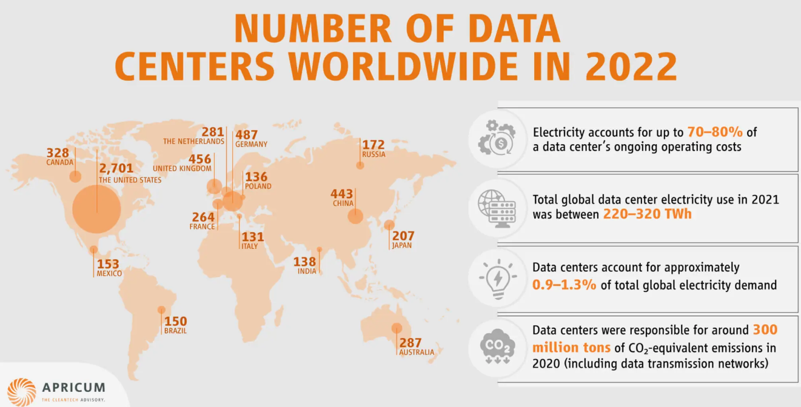
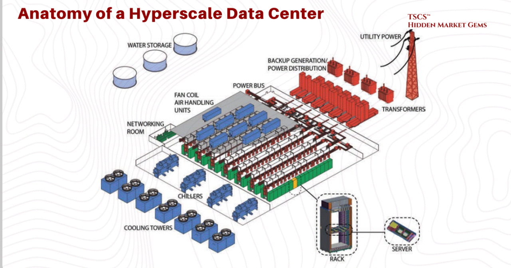
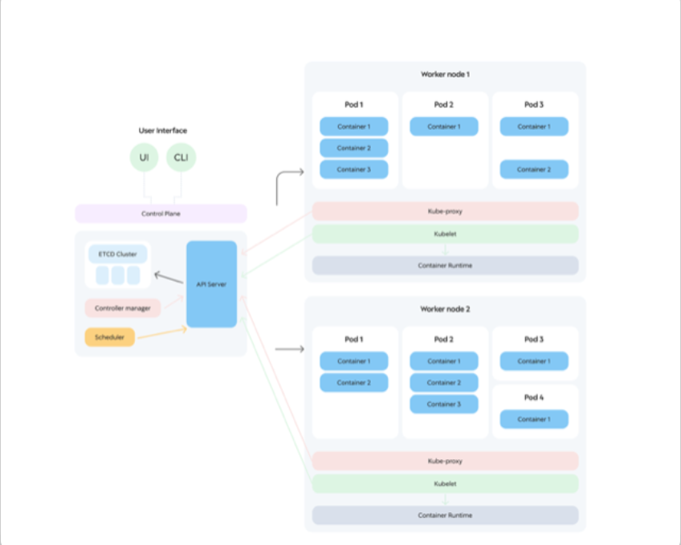
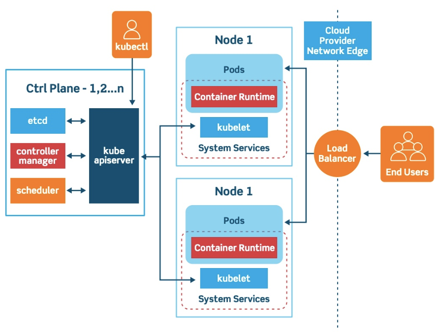
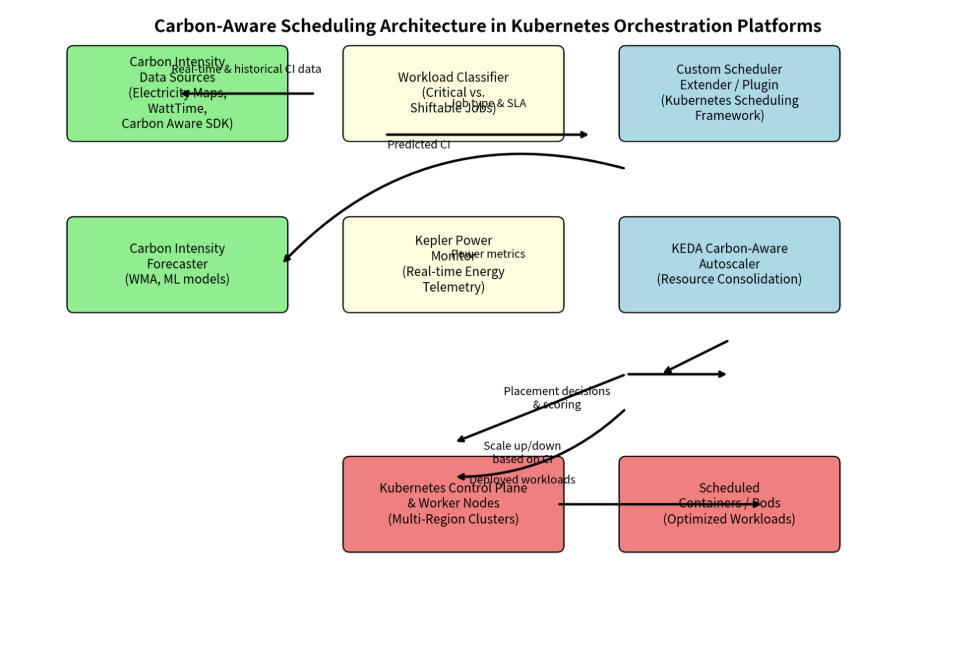
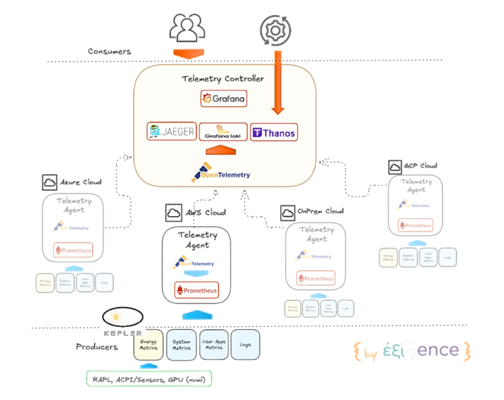
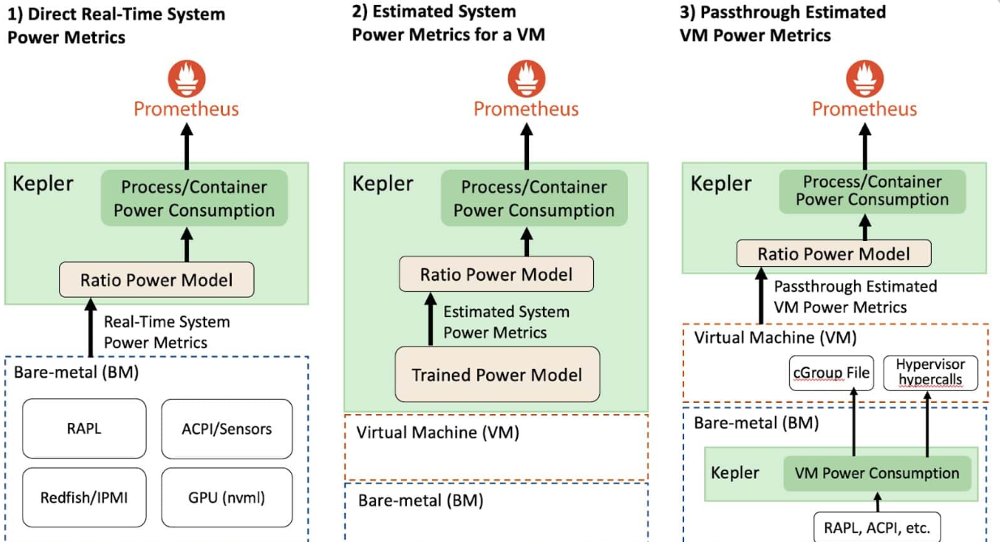

## Overview

The rapid proliferation of cloud-native infrastructure has driven the widespread adoption of container orchestration platforms, epitomized by Kubernetes, to manage increasingly complex and dynamic workloads at hyperscale. Concurrently, data centers have experienced a dramatic surge in energy consumption, with U.S. facilities alone consuming 176 TWh in 2023—representing 4.4% of national electricity demand—and projections indicating potential escalation to 325–580 TWh by 2028 amid AI acceleration. This escalation amplifies the environmental impact of large-scale containerized workloads through elevated operational energy use and embodied carbon in underlying hardware.

Recognizing these challenges, carbon-aware software engineering has emerged as a critical discipline. This study introduces advanced methodologies for quantifying the carbon footprint of container orchestration systems by fusing real-time grid carbon intensity signals, power usage effectiveness (PUE) metrics, and granular telemetry from orchestration layers (including eBPF-based pod-level power profiling). Optimization techniques encompass carbon-intelligent schedulers for temporal and geospatial workload migration, predictive autoscaling, and energy-proportional resource allocation.

Sustainable software engineering requires integrating carbon-aware metrics and optimization strategies directly into container orchestration platforms. Empirical evaluations on production-scale clusters demonstrate substantial emission reductions—up to 35–45%—while preserving service-level objectives, advancing the frontier of green computing in cloud-native environments.

## Introduction to The Rise of Event-Driven Systems

Modern software systems exert a substantial yet often underappreciated influence on global energy consumption, primarily through the infrastructure that powers them. The explosive growth of cloud infrastructure, the proliferation of microservices architectures, and the escalating demand for compute resources have collectively driven data centers to become one of the fastest-growing consumers of electricity worldwide.

**Growth of Cloud Infrastructure**

The shift to cloud-native computing has accelerated dramatically. Hyperscale providers like AWS, Azure, and Google Cloud operate vast networks of data centers distributed globally to deliver scalable, on-demand resources. In recent years, global data center electricity consumption has risen sharply due to this expansion. Estimates place it at around 415–460 TWh in 2024, accounting for approximately 1.5% of total global electricity demand. Projections indicate this could more than double to 945–1,000 TWh by 2030, driven largely by AI workloads and accelerated computing. In the U.S., data centers consumed about 176 TWh in 2023 (roughly 4.4% of national electricity), with forecasts suggesting growth to 325–580 TWh by 2028 (6.7–12% of total U.S. demand).

This map illustrates the global distribution of data centers (as of earlier data around 2022), highlighting concentrations in regions like the United States (over 2,700 facilities), China, and Europe, where energy-intensive operations cluster.

**Explosion of Microservices**

Modern applications increasingly adopt microservices architectures, breaking monolithic systems into dozens or hundreds of small, independently deployable services. While this enhances scalability, resilience, and development velocity, it multiplies resource overhead: each service requires its own container, networking, monitoring, logging, and inter-service communication. This fragmentation leads to higher baseline compute usage, increased network traffic, and more frequent orchestration events. In containerized environments (often managed by Kubernetes), the cumulative effect amplifies energy demands across clusters, as idle or low-utilization microservices still consume power for orchestration, health checks, and redundancy.

**Increasing Demand for Compute Resources**

The rise of AI, machine learning, big data analytics, and real-time processing has intensified compute needs. Training large models and running inference at scale requires specialized hardware like GPUs and TPUs, which draw significantly more power than traditional CPUs. Accelerated servers for AI are projected to see electricity use grow by around 30% annually in base-case scenarios. This surge, combined with always-on expectations for cloud services, pushes data centers toward higher power densities and continuous operation.

**Carbon Emissions from Data Centers**

Data centers' energy use translates directly to carbon emissions, depending on the grid's carbon intensity. Globally, they contribute roughly 0.5% of total CO₂ emissions today (with estimates varying by source and methodology), but this share is expected to rise as consumption doubles or triples without commensurate decarbonization. In 2024, data center-related electricity generation emitted around 182 million tons of CO₂ in some analyses. Emissions are higher in fossil-fuel-dependent regions, while locations with renewable-heavy grids (e.g., parts of Europe or hydro-powered areas) achieve lower footprints. Cooling systems, which can account for 30–40% of energy use, further exacerbate impacts through water consumption and additional power draw.
Software engineers bear direct responsibility for these trends because code and architectural choices profoundly influence resource efficiency. Inefficient algorithms, over-provisioned resources, chatty microservices, or lack of optimization can multiply energy use by orders of magnitude. Conversely, thoughtful design—such as right-sizing instances, implementing efficient data structures, or adopting serverless paradigms—can drastically reduce consumption without sacrificing functionality.

This is why sustainability must become a core non-functional requirement in software engineering. Green Software Engineering (also called sustainable software engineering) is an emerging discipline that applies principles from climate science, hardware awareness, and electricity markets to build carbon-efficient applications. It focuses on three pillars: energy efficiency (consuming the least electricity possible), hardware efficiency (maximizing utilization to extend hardware lifespan), and carbon awareness (shifting workloads to times/locations with cleaner energy). The Green Software Foundation outlines key principles including carbon efficiency, energy proportionality, and embodied carbon minimization.

Sustainable software practices enable organizations to meet net-zero goals, reduce operational costs (as energy often dominates data center expenses), and align with regulatory pressures like carbon reporting mandates.

To visualize the scale and interconnectedness of these systems:

This diagram depicts the anatomy of a hyperscale data center, showing major components: utility power intake, backup generation, transformers, cooling towers and chillers, air handling units, networking rooms, server racks, and power distribution buses. Energy flows from external sources through these layers to power compute workloads.

Here is a high-level view of a container orchestration platform (Kubernetes) cluster, illustrating the control plane (API server, scheduler, etcd) managing worker nodes with pods and containers. Such clusters form the backbone of modern cloud-native workloads, where inefficient orchestration directly contributes to energy waste across distributed data centers.

Another architectural overview of Kubernetes shows the master/control plane interacting with nodes hosting pods, emphasizing networking and load balancing—elements that consume additional energy in large-scale deployments.

By integrating green principles into software design—from code-level optimizations to carbon-aware scheduling in orchestration platforms—engineers can mitigate the environmental footprint of these systems while supporting innovation in cloud-native environments.

The Green Software Foundation (GSF) is a non-profit organization dedicated to advancing sustainable software development and reducing the environmental impact of software systems. Established in 2021 under the Linux Foundation (initially launched by founding members including Accenture, GitHub, Microsoft, and ThoughtWorks), the GSF brings together individuals, companies, researchers, and open-source contributors to build a trusted ecosystem of people, standards, tooling, best practices, and community resources for creating green software.

**Core Mission and Definition**

The foundation's mission is to create and promote practices that enable software to emit fewer greenhouse gases. It defines green software as:

"Software that is responsible for emitting fewer greenhouse gases. Our focus is reduction, not neutralisation."

This emphasizes proactive minimization of emissions through better design and operations rather than relying solely on carbon offsets. Green software sits at the intersection of climate science, software architecture, electricity markets, hardware awareness, and data center operations.
The GSF works to shift the culture of software development so that sustainability becomes a first-class concern—treated with the same priority as performance, security, reliability, and cost.

**Key Principles of Green Software**

The GSF maintains a widely adopted set of principles (originally eight, refined over time based on community input) that guide practitioners in building more sustainable applications. These are grouped around three primary pillars:

1. **Energy Efficiency** — Consume the least amount of electricity possible for a given workload.
   
2. **Hardware Efficiency** — Maximize utilization of existing hardware and minimize embodied carbon (emissions from manufacturing servers, devices, etc.) by extending hardware lifespan and reducing unnecessary resource demands.
   
3. **Carbon Awareness (or Carbon Intensity)** — Optimize timing, location, and intensity of compute to use electricity when it is cleanest (e.g., shifting workloads to periods or regions with high renewable energy availability).

**Additional supporting principles include:**

Carbon — Build applications that are carbon efficient overall.

Embodied Carbon — Reduce the carbon footprint embedded in hardware and infrastructure.

Energy Proportionality — Design systems that scale energy use linearly with load (avoiding high idle power draw).
Demand Shaping — Influence user or system behavior to align with cleaner energy availability.

Measurement & Optimization — Continuously measure emissions and iterate toward lower impact.

These principles are detailed on the dedicated site principles.green, which serves as a living resource with patterns, examples, and implementation guidance across domains like cloud, AI, web, and mobile.

Major Activities and Contributions

**Open-Source Projects and Tooling** — The GSF hosts numerous open-source initiatives, including:

**Impact Framework** — For accurate computation and reporting of software's environmental impact.

Carbon-aware patterns and libraries (e.g., for scheduling workloads based on grid carbon intensity).
Awesome Green Software — A curated directory of tools, research, code, and training resources.

**Working Groups** — Community-driven groups focused on areas like principles & patterns, open source, innovation, training, and measurement standards.

**Learning & Training** — Free, open-source training programs via learn.greensoftware.foundation to help developers build careers in green software.

**Patterns Catalog** — A growing repository of proven design patterns for reducing emissions in AI, cloud-native, and web applications (patterns.greensoftware.foundation).

**State of Green Software Report** — An annual publication tracking trends, challenges, and progress in decarbonizing software.

**Champions Program** — A directory recognizing individuals actively contributing to the movement.

**Why It Matters**

Software's environmental footprint is growing rapidly due to cloud expansion, AI compute demands, and always-on microservices. The GSF provides actionable, standardized ways for engineers, architects, and organizations to measure, optimize, and report emissions—helping align with corporate net-zero goals, regulatory requirements, and cost savings (since energy often dominates cloud bills).

Membership includes major tech companies (Google, Intel, Microsoft, Salesforce, and many others), enabling cross-industry collaboration to standardize green practices and accelerate adoption.
For the most up-to-date information, visit the official site: greensoftware.foundation. The foundation continues to evolve rapidly, with increasing emphasis on integrating sustainability into DevOps pipelines, AI workloads, and enterprise transformation.

## Foundations of Event-Driven Architectures

Event-driven architecture (EDA) is a software design pattern where system components communicate asynchronously by producing, detecting, routing, and reacting to events rather than through direct synchronous calls (like REST APIs or RPC). This decoupling enables greater scalability, resilience, flexibility, and real-time responsiveness in distributed systems, microservices, and cloud-native environments.

Events are typically lightweight, factual statements written in the past tense. They do not contain commands or requests for action; instead, they notify interested parties that "this has occurred."

Common characteristics of events:

Immutable — Once created, the event record never changes (no updates or deletes).

Time-stamped — Usually includes metadata like occurrence timestamp, producer identity, version, and correlation IDs.

Self-describing — Contains enough context (payload + metadata) so consumers understand what happened without needing to query back to the source.

Examples:

OrderCreated — (orderId: "ORD-456", customerId: "CUST-789", items: [...], total: 149.99, timestamp: "2026-03-07T18:30:00Z")

PaymentProcessed — (orderId: "ORD-456", paymentId: "PAY-101", amount: 149.99, status: "success", method: "credit_card")

ShipmentDispatched — (orderId: "ORD-456", trackingNumber: "1Z999", carrier: "UPS", dispatchedAt: "2026-03-08T09:15:00Z")

These events form the historical record of what happened in the business domain.
Event Streams

An event stream is an ordered, append-only sequence of related events. It represents the complete history of state changes for a particular entity, process, or domain concept (often called an aggregate in domain-driven design).

In practice:

Events are appended to the end of the stream in the order they occur.

The stream is durable and replayable — consumers can read from the beginning (to rebuild state) or from a specific point.

Streams provide a single source of truth for "what happened."

Mathematically, we can model an event stream as an ordered sequence:

Let E be the set of all possible events in the system.

An event stream for a specific entity (e.g., order #456) is a finite, totally ordered sequence:
S = (e₁, e₂, e₃, ..., eₙ)

where each eᵢ ∈ E, and the indices reflect chronological order of occurrence (i < j implies eᵢ happened before eⱼ).
More formally:

S = ⟨e₁, e₂, ..., eₙ⟩ where the ordering is strict and preserved.

This sequence captures every state transition that the entity has undergone.
Event Brokers

An event broker (also called message broker, event bus, or streaming platform) is the middleware infrastructure responsible for reliably transporting events from producers to consumers.

**Key responsibilities include:**

Event routing — Directing events to the right consumers based on topics, keys, subscriptions, or filters.

Event persistence — Storing events durably (often for days, weeks, or indefinitely) so they survive failures and can be replayed.

Delivery guarantees — Providing semantics like at-least-once, at-most-once, or exactly-once delivery.

Scalability & fault tolerance — Distributing load across nodes, replicating data, and handling broker failures.

Ordering & partitioning — Maintaining order within logical streams or partitions.

Popular event brokers include Apache Kafka (most common for high-throughput streaming), Apache Pulsar, RabbitMQ (for traditional queuing), AWS Kinesis, Azure Event Hubs, Google Pub/Sub, and Redpanda.

Distributed Commit Logs

Modern event-driven systems (especially those using Kafka-like platforms) treat the event broker as a distributed commit log — a highly available, durable, append-only log service distributed across many machines.

Key Properties of a Distributed Commit Log

1. **Append-only storage**
   
Events are written sequentially to the end of a log segment. No in-place updates or random writes occur. This enables extremely fast writes (sequential disk I/O) and simplifies crash recovery.

2. **Partitioned logs**
   
A logical stream (called a topic in Kafka) is divided into multiple partitions. Each partition is an independent, ordered, append-only log stored on disk.
Partitions enable horizontal scalability: more partitions → more parallelism for producers and consumers.

Events with the same key (e.g., orderId) are deterministically routed to the same partition via hashing → guarantees order for related events.

3. **Ordered event processing**
   
Within each partition, events are strictly ordered by their offset (a sequential integer assigned on append).

Producers append → get assigned offset.

Consumers read sequentially from a chosen offset.

Global order is not guaranteed across partitions, but per-partition order is strong.

This trade-off allows massive throughput while preserving business-relevant ordering (e.g., all events for one order stay ordered).

For any two events e_a and e_b in the same partition with offsets offset_a < offset_b, the system guarantees that if a consumer sees e_b, it has already seen (or can replay) e_a.

**This structure supports powerful patterns**:

Event sourcing — Rebuild current state by replaying the entire stream:

current_state = fold(apply, initial_state, S)

(where apply is a pure function that evolves state given an event)

Exactly-once processing — Consumers track their committed offsets; brokers and transactional producers ensure atomicity.

Temporal joins, windowing, and stream processing — Tools like Kafka Streams or Flink operate over these ordered log

Think of the distributed commit log as a giant, shared, crash-proof notebook where every important thing that happens in your system gets written down forever in strict order (at least within each section of the notebook). Multiple teams can read the notebook independently, starting from wherever they left off, without ever interfering with the writer or each other. Because it's partitioned and replicated, the notebook can grow to petabyte scale and survive disasters.

This foundation — immutable events + ordered streams + durable, partitioned commit logs — is what powers reliable, scalable, real-time systems in companies like Netflix, Uber, LinkedIn, and thousands of others building event-driven architectures today.

**Message Delivery Semantics in Event-Driven Architectures**

In distributed systems and event-driven architectures (especially with brokers like Apache Kafka, Pulsar, or RabbitMQ), message delivery semantics define the guarantees about how many times a message (or event) is delivered to a consumer and processed. These semantics strike a balance between reliability, performance, latency, and complexity. They are crucial because network partitions, crashes, retries, and broker failures are inevitable in distributed environments.

The three primary semantics are:

At-most-once delivery

At-least-once delivery

Exactly-once delivery (also called exactly-once semantics or EOS)

These apply end-to-end but are often discussed in terms of producer-to-broker, broker-to-consumer, and full read-process-write pipelines.

1. **At-Most-Once Delivery**
   
Definition: A message is delivered zero or one time. The system makes a best-effort attempt to deliver it once, but if anything goes wrong (network failure, broker crash, timeout), the message is simply dropped and never retried or redelivered.

**How it works in practice (e.g., in Kafka)**:

Producer sends a message and does not wait for acknowledgment (acks=0) or uses fire-and-forget mode.
If the broker acknowledges but then the producer times out before receiving it, the producer does not retry.

Consumer commits its offset before processing the message (or auto-commits aggressively). If the consumer crashes after processing but before committing, the message is never re-fetched.

**Risks and trade-offs**:

Primary risk: Message loss. Critical business events (e.g., PaymentProcessed, inventory deduction) can vanish silently.

**Advantages**:

Lowest latency (no blocking waits for acks or retries).

Minimal overhead and simplest implementation.

Highest throughput in stable networks.

When to use: Non-critical telemetry, logging, monitoring metrics, real-time analytics where occasional loss is tolerable (e.g., dropping a few sensor readings).

Real-world example: A high-volume IoT system sending temperature readings every second—losing one or two is acceptable, but duplicates would skew averages unnecessarily.

**At-Least-Once Delivery**

Definition: A message is delivered one or more times. The system guarantees no loss (the message will eventually arrive), but duplicates are possible under failure scenarios.

How it works in practice (default in most modern brokers like Kafka):

Producer configures retries (acks=1 or acks=all) and waits for broker acknowledgment.

If no ack is received (timeout, broker failure), producer retries sending the same message.

Broker may write the message successfully but crash before sending ack → retry causes duplicate write.

Consumer processes the message and commits offset after successful processing.

If consumer crashes after processing but before committing offset, the broker re-delivers the batch on restart → duplicate processing.

**Risks and trade-offs**:

Primary risk: Duplicate processing. This can lead to incorrect state (double-charging a customer, sending two shipments, over-counting votes).

Mitigations (partial):

Idempotent consumers (e.g., use unique message IDs or business keys to detect and skip duplicates).

Downstream deduplication logic.

**Advantages:**

Strong reliability: no data loss even during failures.

Reasonable performance (retries are bounded).

Default behavior in Kafka (pre-0.11 or without explicit EOS config).

When to use: Most production systems where duplicates can be handled idempotently or tolerated with business logic (e.g., financial ledgers with reconciliation, order processing with unique order IDs).

Real-world example: An e-commerce order system — if OrderCreated is processed twice, idempotent handling (check if order already exists) prevents double fulfillment.

3. **Exactly-Once Delivery / Processing**
   
Definition: Each message is delivered and processed exactly once — no losses and no duplicates, even in the presence of failures, retries, broker crashes, or network issues. This is the strongest guarantee and the holy grail of distributed systems messaging.

How it is achieved (Kafka since 0.11 — the most mature implementation):

Exactly-once is not just delivery — it's end-to-end exactly-once processing in read-process-write pipelines.

***Two key building blocks***:

Idempotent Producers (foundation for single-partition EOS):

Producer gets a unique Producer ID (PID) and maintains monotonic sequence numbers per partition.

Broker tracks the highest seen sequence per PID+partition.

Retries with the same sequence number are deduplicated by the broker (duplicate discarded).

Config: enable.idempotence=true (now default in recent Kafka versions with acks=all).

Transactions (for cross-partition, multi-topic, atomic read-process-write):

Producer gets a unique transactional.id (durable fence against zombie producers).

Producer begins a transaction → writes to multiple partitions/topics atomically.

Consumer offsets can be committed inside the same transaction (via sendOffsetsToTransaction).

Only committed transactions are visible to consumers (isolation level read_committed).

On abort/failure, all writes in the transaction are discarded.

Zombie fencing: New producer instance with same transactional.id causes old one to abort pending transactions.

**Full pipeline for exactly-once:**

1. Consumer reads batch (isolation read_committed).
   
2. Processes messages.

3. Producer starts transaction.

4. Writes output messages + commits input offsets atomically.

5. Transaction commits → outputs visible, offsets advanced.

6. If crash mid-process: offsets not committed → messages re-fetched, but idempotent producer prevents duplicate writes.

**Risks and trade-offs**:

Primary risk: None for correctness (no loss/duplicates), but performance cost — higher latency, throughput reduction (10–30% in some benchmarks), increased coordination overhead.

Complexity: Requires careful configuration (transactional.id, isolation.level), handling transaction timeouts, fencing zombies.

When to use: Financial systems, inventory management, payment processing, stream processing (Kafka Streams with processing.guarantee=exactly_once_v2), any domain where duplicates cause real business harm and reconciliation is expensive.

Comparison table:

| Delivery Guarantee | Delivery Count | Primary Risk | Performance / Latency | Implementation Complexity | Typical Use Cases | Kafka Default / Config Example |
|--------------------|---------------|--------------|-----------------------|---------------------------|-------------------|--------------------------------|
| At-most-once | 0 or 1 | Message loss (dropped events) | Lowest latency, highest throughput | Very low | Metrics, logs, non-critical telemetry | `acks=0`, no retries; auto-commit before processing |
| At-least-once | 1 or more | Duplicate processing (over-application) | Moderate (retries add overhead) | Low to moderate | Most business apps with idempotent logic | Default (`acks=all`, `enable.idempotence=false`) |
| Exactly-once | Exactly 1 | Minimal (primarily performance cost) | Highest latency, reduced throughput | High | Finance, payments, inventory, streaming ETL | `enable.idempotence=true` with `transactional.id` set |

In modern systems (especially Kafka), exactly-once has become achievable and increasingly the default aspiration for mission-critical workloads. It builds directly on the distributed commit log foundation, turning the append-only, ordered nature of partitions into a powerful tool for atomic, fault-tolerant processing. Achieving it requires understanding idempotency, transactions, and fencing — but the payoff is dramatically simpler and more reliable applications.

**Energy Consumption in Containerized Environments**

Containers represent one of the most efficient forms of application isolation in modern infrastructure, yet they still translate directly into measurable electrical power draw at the hardware level. Unlike virtual machines that emulate an entire guest operating system and hardware stack, containers rely on Linux kernel features — primarily namespaces (for isolation of processes, networks, filesystems, and users) and cgroups (control groups for resource accounting and limiting). This shared-kernel model means there is almost zero overhead from hypervisor emulation (typically less than 2% extra CPU cycles), but it also means that every container workload exercises the exact same physical hardware components as a native process would. The host kernel’s scheduler, memory management unit, block layer, and network stack have no idea they are dealing with “containers” — they simply see processes, memory pages, I/O requests, and packets.

The net result is that energy consumption in containerized environments is driven by the same physics as any Linux workload, but scaled across hundreds or thousands of microservices running simultaneously on shared nodes. Power is not consumed by the “container” abstraction itself; it is consumed when the CPU executes instructions, when DRAM refreshes bits, when storage devices perform reads/writes, and when network interface cards transmit/receive packets. Modern data-center servers consume 200–800 W at the wall under load, and container orchestration platforms (Kubernetes, Nomad, etc.) simply distribute that power across pods.

**Major Energy Consumers**

Here are the four dominant contributors, ranked by typical share of total energy in production container clusters (based on real telemetry from tools like Kepler, Scaphandre, and PowerAPI):

1. **CPU Usage — Usually 40–65% of total container energy**
   
Modern server CPUs (Intel Xeon, AMD EPYC, ARM Ampere) use dynamic voltage and frequency scaling (DVFS). When a container’s threads become runnable, the kernel scheduler wakes cores, raises frequency (often to 2.5–3.5 GHz), and increases voltage. Dynamic power follows the relationship where power grows roughly with the square of voltage and linearly with frequency and utilization. Even a single busy thread can prevent an entire core from entering deep sleep states (C6/C7), keeping leakage current high.

In practice, a Kubernetes pod running a Java microservice at 30% CPU on a 64-core node can easily draw 15–25 W more than an idle core. Tools using eBPF (extended Berkeley Packet Filter) or Intel RAPL registers now attribute this power down to the exact pod and container ID in real time.

2. **Memory Utilization — Typically 20–30% of total energy**
   
DRAM is never truly “off” while powered on. It requires constant refresh cycles (every 64 ms or so) to prevent bit rot, consuming a baseline 0.1–0.3 W per GB even with zero access. When a container allocates memory (via malloc, Java heap, or Go runtime), the kernel pins physical pages, and every read/write access triggers row activation and column access in the memory controller — each costing picojoules that add up at scale.

Over-allocated but under-used memory (very common in containers) prevents the memory controller from power-gating ranks or channels. High memory pressure also triggers kernel reclaim, kswapd activity, and potential swapping — all of which burn extra CPU and storage energy.

3. **Storage I/O — 10–20% depending on workload**

Every container filesystem operation (reads from container image layers, writes to ephemeral storage, or persistent volumes) goes through the kernel’s block layer. For SSDs/NVMe, this means the drive controller wakes from low-power states, performs NAND program/erase cycles, and activates PCIe lanes. Random I/O patterns (common in databases inside containers) are particularly expensive because they prevent the drive from entering deep idle states. Overlay filesystems (overlay2, AUFS) add extra metadata lookups and copy-on-write operations, increasing I/O amplification by 10–30%. In Kubernetes, PersistentVolumeClaims backed by cloud block storage add network round-trips, multiplying the energy cost.

4. **Network Communication — 8–15% and growing with microservices**
   
Every inter-pod or external request forces the network interface card (NIC) and the kernel’s TCP/IP stack into active mode. Packet processing (checksums, segmentation offload, routing) burns CPU cycles on the host, while the NIC itself scales power with packet rate and bandwidth (a 100 Gbps NIC can draw 15–25 W at full load). East-west traffic between microservices inside the same cluster is especially wasteful because it often traverses the full network stack twice (through kube-proxy or Cilium eBPF). Modern service meshes (Istio, Linkerd) add yet another layer of encryption and telemetry, further increasing packet processing overhead.

**Resource Utilization Inefficiencies**

The biggest energy waste in containerized environments does not come from the containers themselves but from how poorly they utilize the underlying hardware. Real-world cluster studies consistently show average CPU utilization of only 15–35% and memory utilization around 40–60% — meaning 60–85% of the power being paid for is essentially wasted.

**Idle containers**

Even a “sleeping” container (e.g., a sidecar waiting for traffic or a cron job between runs) keeps its cgroups active. The kernel still schedules its processes periodically for health checks, and the memory pages remain resident. Most critically, idle containers prevent CPU cores from entering the deepest C-states and keep DRAM refresh active. A single idle pod on a node can prevent the entire socket from dropping below 40–50 W baseline power. In large clusters, thousands of such “zombie” pods (left behind by failed deployments or over-scaled replicas) can waste hundreds of kilowatts continuously.

**Over-provisioning**

Kubernetes pods declare resource requests and limits that are often set 2–5× higher than actual usage (a common anti-pattern driven by fear of throttling). The scheduler places pods based on these inflated requests, leaving entire nodes under-utilized. The hardware still draws near-peak power because modern servers have poor energy proportionality below 30–40% load — a node at 20% utilization may still consume 70% of its maximum power. This leads to “stranded capacity”: paid-for silicon sitting idle.

**Inefficient scheduling**

The default Kubernetes scheduler optimizes for bin-packing or spread (to improve availability), but not for energy. It can create thermal hotspots (one node at 95% CPU while neighbors idle) or schedule network-heavy pods across distant racks, inflating data-center network energy. It also ignores power-aware metrics such as current grid carbon intensity, time-of-day electricity prices, or node-level power caps. Advanced research schedulers (e.g., those using Kepler metrics or Carbon-Aware Kubernetes) show 25–45% energy savings simply by moving workloads to cooler nodes, lower-power CPU architectures, or renewable-rich regions.

These inefficiencies compound: an idle container on an over-provisioned node running inefficiently scheduled pods can waste 3–5× more energy than a well-optimized equivalent workload.

The total energy consumed by any containerized workload can be modeled as the weighted sum of its four main resource drivers. In simple terms, imagine the energy cost is a recipe that adds up four ingredients, where each ingredient has its own “price per unit” that depends on the hardware, cooling efficiency, and electricity source.

**Energy for one workload equals**:

(the coefficient for CPU multiplied by how much CPU it actually used)
plus (the coefficient for memory multiplied by how much memory it kept allocated)
plus (the coefficient for storage operations multiplied by how many read/write operations it performed)

plus (the coefficient for network multiplied by how many bytes or packets it sent and received).
Each coefficient (α, β, γ, δ) is not a fixed number — it changes with server model, power usage effectiveness of the data center, and even the carbon intensity of the local grid. In real systems, these are measured empirically using tools that sample power every few seconds and correlate it with cgroup statistics. The beauty of this model is that once you have the coefficients for your hardware, you can predict and optimize energy before deploying. For example, reducing memory allocation by 30% might cut total energy by only 8% if memory’s coefficient is small, but eliminating unnecessary network chatter could save 15–20% if network’s coefficient is high. Modern carbon-aware schedulers use exactly this kind of linear model (sometimes extended with non-linear terms for very high loads) to decide when and where to run each pod.

By measuring these components at pod granularity and feeding them back into orchestration decisions, sustainable software engineering can move from reactive “turn off idle servers” to proactive, workload-level energy optimization — often achieving 30–50% reductions without any code changes. This is the foundation for the next-generation carbon-aware container platforms we discussed earlier.

**Measuring Carbon Footprint of Cloud Workloads**

Measuring the carbon footprint of software systems—particularly cloud-native and containerized workloads—requires translating compute activity into greenhouse gas emissions (primarily CO₂ equivalent, or CO₂e). This process bridges hardware physics, electricity markets, and software behavior. Accurate measurement enables benchmarking, optimization, regulatory compliance (e.g., CSRD, SEC climate disclosures), and carbon-aware decision-making.

The core equation for operational carbon emissions of a workload is:

Carbon emissions (kg CO₂e) = Energy consumed (kWh) × Carbon intensity (kg CO₂e / kWh)

This simple formula hides significant complexity in sourcing accurate inputs for each term, especially at workload granularity (per pod, per service, per application).

**Key Metrics**

**Energy Consumption**

The foundational input: how many kilowatt-hours (kWh) a workload actually uses over a period (e.g., per hour, day, or request).

Measured at the server level via hardware interfaces (Intel RAPL, AMD Ryzen Master, NVIDIA GPU power counters) or kernel-level sampling.

Attributed to workloads using Linux cgroups (for containers/pods), process telemetry, or eBPF probes.

Tools derive per-workload energy from total node power minus baseline idle power, prorated by utilization metrics (CPU %, memory resident, I/O bytes).

**Carbon Emissions (kg CO₂e)**

The end-goal metric: total greenhouse gases released to power the workload.

Computed by multiplying energy by the grid carbon intensity at the data center's location and time.

Includes location-based (actual grid mix) and market-based (accounting for purchased renewables or RECs) methods per GHG Protocol Scope 2.

Embodied emissions (manufacturing servers, networking gear) are sometimes added as a smaller, amortized term (e.g., via SCI specification).

**Workload Efficiency**

A ratio that normalizes impact: emissions per functional unit.

Examples: kg CO₂e per API request, per ML inference, per GB processed, per user session, or per dollar of revenue.

The Software Carbon Intensity (SCI) score from the Green Software Foundation formalizes this:
SCI = (E × I) / R

where E = energy (kWh), I = carbon intensity (kg CO₂e/kWh), R = functional units (e.g., number of requests).

Lower SCI indicates greener software; it encourages optimization beyond just using clean energy.

**Carbon Intensity of Electricity**

The variable multiplier: grams of CO₂e per kWh of grid electricity.

Varies dramatically by region and time: coal-heavy grids (~800–1000 g/kWh), hydro/nuclear (~10–50 g/kWh), renewable peaks near 0 g/kWh.

Time-granular (hourly or 5-min) data is critical because grids shift dramatically (solar peaks midday, wind at night).

Tools use real-time APIs to fetch marginal intensity (the intensity of the next kWh added/removed), which is best for optimization decisions.

**Data Sources**

**Energy Monitoring Tools**

Kepler (Kubernetes-native, uses eBPF + RAPL for pod-level power).

Scaphandre, PowerAPI, Cloud Carbon Footprint (open-source, multi-cloud estimates).

Cloud-provider dashboards: AWS Customer Carbon Footprint Tool, Google Cloud Carbon Footprint, Azure Emissions Impact Dashboard.

Hardware telemetry: Intel RAPL, NVIDIA DCGM, AMD uProf.

**Power Usage Effectiveness (PUE)**

Ratio of total facility power to IT equipment power (typical 1.1–1.8 in modern data centers).

Multiplies raw IT energy to get total energy draw (including cooling, lighting, losses).

Hyperscalers publish average PUE (Google ~1.10, AWS ~1.135) and sometimes per-region values.

**Grid Carbon Intensity APIs**

Electricity Maps (real-time, marginal & average intensity globally, free tier).

WattTime (emissions signals for marginal carbon).

Carbon Intensity API (UK-focused but expanding).

Provider-specific: Google uses hourly grid data; AWS provides location-based factors.

**Carbon Accounting Pipeline for Cloud Workloads**

A typical pipeline aggregates these sources into actionable insights. It follows this logical flow:

**Telemetry Collection** — Gather raw resource metrics (CPU seconds, memory GB-seconds, network bytes, storage I/O) from orchestration layer (Kubernetes metrics API, cloud billing APIs) and power sampling tools (Kepler probes on nodes).

**Energy Estimation/Measurement** — Convert utilization metrics to energy (kWh).
Use models (e.g., Cloud Carbon Footprint regressions) or direct power metering (RAPL + attribution to cgroups/pods).

**Apply PUE multiplier to get total facility energy**.

**Carbon Intensity Lookup** — Fetch time- and location-specific grid intensity (from APIs like Electricity Maps) for the data center region and timestamp of usage.

**Emissions Calculation** — Multiply energy by intensity → kg CO₂e.

Aggregate by workload (pod, deployment, namespace), service, team, or application.
Optionally include embodied carbon (amortized server manufacturing emissions).

**Normalization & Reporting** — Compute efficiency metrics (SCI, emissions per request).

Store in time-series DB (Prometheus) or data lake.

Visualize dashboards (Grafana, cloud-native tools) showing trends, hotspots, forecasts.

Export for corporate GHG reporting or feed into carbon-aware schedulers.

By implementing such a pipeline, teams gain visibility into which workloads, regions, or architectural choices drive the majority of emissions—enabling targeted reductions (e.g., shifting to low-carbon regions, optimizing code, rightsizing resources) while preserving performance. This closes the loop from measurement to meaningful decarbonization in cloud environments.

Carbon accounting for software systems focuses on measuring and assigning responsibility for the greenhouse gas emissions (primarily CO₂ equivalent, or CO₂e) caused by running software. This includes emissions from electricity used by servers, data centers, networks, and devices, as well as embodied emissions from hardware manufacturing and disposal.

Unlike traditional corporate carbon accounting (which follows the GHG Protocol's Scopes 1–3 for organizations), software-specific approaches emphasize how much carbon a particular application, workload, or piece of code contributes. This helps developers, cloud users, and organizations make greener design choices, optimize efficiency, and report software sustainability.
Here are the main methods to quantify emissions in software systems:

**Attribution Models**

These models decide how to fairly assign (attribute) the emissions from shared infrastructure (like cloud data centers) to specific software workloads or users. In multi-tenant environments (e.g., AWS, Azure, Google Cloud), many applications run on the same physical hardware, so emissions aren't directly "owned" by one tenant.

**Common approaches include**:

Proportional allocation based on resource share (e.g., CPU time, memory, or storage used).
Cost-based (e.g., billing dollars as a proxy for usage).

Advanced fair attribution models (like Fair-CO₂ research) that consider both operational emissions (running the system) and embodied emissions (hardware lifecycle), aiming for equitable distribution across tenants.

Use-based models that allocate based on actual consumption rather than averages.

Cloud providers like AWS use updated methodologies (e.g., in their Customer Carbon Footprint Tool) that allocate rack-level emissions to services, then to customer accounts based on usage patterns. These help avoid over- or under-attributing emissions in shared environments.

**Infrastructure-Based Accounting**

This approach looks at the total emissions from the underlying hardware and infrastructure, then divides them across all workloads running on it.

Measure the overall energy consumption and carbon footprint of servers, data centers, networking, etc.
Divide the total emissions proportionally among applications or tenants (e.g., if your software uses 5% of a server's resources over a period, it gets assigned 5% of that server's emissions).
Pros: Simple when you have aggregate data from the provider; captures idle energy and shared overhead.

Cons: Less precise for individual software behavior; doesn't reward highly efficient code.
Often used by cloud providers for high-level reporting.

**Usage-Based Accounting**

This is more granular and ties emissions directly to how much a specific software workload consumes resources.

Track metrics like CPU-seconds, GPU hours, data transferred, storage reads/writes, or API calls.

Multiply usage by energy-per-unit estimates, then by the carbon intensity of the electricity (grams CO₂e per kWh, which varies by region and time).

Pros: Encourages optimization (e.g., efficient algorithms reduce allocated emissions); better for comparing software versions or design choices.

Cons: Requires detailed telemetry/monitoring; harder to implement without instrumentation.
Many modern tools and cloud dashboards lean toward this for customer-facing reports.

 Workload Carbon Cost

A widely adopted, detailed model for calculating the carbon cost of a software workload comes from the Software Carbon Intensity (SCI) specification (from the Green Software Foundation, now an ISO standard: ISO/IEC 21031).

The core formula for the workload carbon cost (often denoted as C_w or just the carbon emissions attributed to the workload) is:

$$
C_w = \sum_{i=1}^{n} (Energy_i \times CarbonIntensity_i)
$$

The full SCI score often normalizes this as a rate (emissions per functional unit) to make it comparable:

SCI = (E × I + M) per R
Where:

E = total energy consumed by the software (kWh),

I = carbon intensity of the electricity (gCO₂e/kWh, often location-based or marginal),

M = embodied emissions (e.g., share of hardware manufacturing/depreciation attributed to this software, in gCO₂e),

R = functional unit (e.g., per API call, per user, per ML inference, per GB processed — whatever makes sense for scaling your app),

So SCI gives emissions per unit of work, helping compare efficiency.

**In practice:**

Measure or estimate E using tools like cloud provider APIs, power meters, or models (e.g., from telemetry).

Get I from real-time grid data sources (e.g., Electricity Maps, WattTime).
M is trickier — use lifecycle averages for servers (often small compared to operational energy for long-running systems).

The summation lets you account for workloads that run across different machines or regions (e.g., edge + cloud).

This model promotes transparency: report the boundary (what's included), scaling factor (R), and assumptions. It drives better decisions — e.g., run batch jobs when the grid is green, optimize code to use less energy, or shift to efficient hardware.

Overall, combining these (usage-based + SCI-style math + fair attribution) gives the most accurate picture for software emissions today. Tools from the Green Software Foundation, cloud providers, and emerging standards help implement them.

**Carbon-Aware Container Scheduling**

How orchestration platforms reduce emissions through intelligent workload orchestration
Container orchestration platforms — above all Kubernetes, but also Nomad, Nomad with extensions, and serverless layers such as Knative — are uniquely positioned to cut greenhouse-gas emissions because containers are stateless or easily replicable, workloads can be moved across regions or delayed in time, and the platform already controls where and when every pod runs. By feeding real-time and forecasted carbon intensity (grams CO₂e per kWh) into the scheduling loop, these platforms directly act on the two variables that determine workload carbon cost:

$$
C_w = ∑_{i=1}^n (Energy_i × CarbonIntensity_i)
$$

 every joule of electricity your containers consume is multiplied by how dirty (or clean) the local electricity grid is at that exact moment and location. The lower the CarbonIntensity_i term and the smaller the total Energy_i (through better packing), the lower the emissions. Real-world implementations achieve 20–51 % reductions with less than 5 % performance impact when workloads have any flexibility.

The three core levers are spatial placement optimization, temporal shifting, and resource consolidation. All three are implemented today as lightweight extensions to the Kubernetes scheduler (Scheduling Framework plugins or scheduler extenders) and autoscalers (KEDA, Karpenter, Cluster Autoscaler).

**Workload Placement Optimization (Spatial Shifting)**

Modern multi-region or multi-cluster Kubernetes deployments (using Karmada, Liqo, or native cloud multi-region node pools) treat every availability zone or cloud region as a candidate node. Carbon intensity can differ by 5–10× between regions at any given hour (e.g., Nordic hydro/wind vs. coal-heavy regions).

**How platforms implement it**

A sidecar or operator continuously pulls marginal operating emissions rate (MOER) or average grid intensity from Electricity Maps, WattTime, or the Green Software Foundation’s Carbon Aware SDK.
The scheduler’s Filter phase discards any node/region whose current or 1-hour-ahead carbon intensity exceeds a configurable threshold (e.g., 400 gCO₂e/kWh).

**The Score phase computes a composite carbon-aware score:**

Score = w_resource × ResourceFitScore + w_carbon × (1 − normalised_CI) + w_latency × (1 − normalised_latency_distance)

Normalised_CI scales the intensity across all candidate regions to [0,1] so it can be fairly compared with CPU/memory fit and network latency. The weights are tunable by operators or even adjusted dynamically based on corporate carbon budgets.

Stateless microservices, serverless functions (Knative), and replicable batch jobs move transparently. Stateful workloads use data-replication patterns or read-replicas to keep migration cost low. Papers show 30–70 % emission cuts for web services when latency budgets are relaxed from 20 ms to 100 ms.

**Temporal Workload Shifting**

Many workloads (ML training, ETL pipelines, video transcoding, nightly reports, CI/CD runners) are delay-tolerant within hours or days. Orchestrators exploit this by queuing jobs and releasing them only when the grid is cleanest.

**Implementation pattern**

Jobs are annotated with priority class (critical vs. flexible) and maximum acceptable delay (e.g., 24 h SLA).

A carbon forecaster (simple Weighted Moving Average or LSTM) predicts the next 24–48 h carbon intensity curve per region.

KEDA (Kubernetes Event-Driven Autoscaling) is extended with a custom metric provider: “carbon_intensity”. Replicas scale to zero or minimum during high-carbon windows and burst during low-carbon “green windows”.

The scheduler’s QueueSort or a custom controller holds flexible pods until the optimal window opens, then hands them to the normal scheduler.

Microsoft, Google (Carbon-Intelligent Compute), and open-source projects such as CarbonScaler demonstrate this pattern at scale. CarbonScaler dynamically adjusts Kubernetes HorizontalPodAutoscaler targets and achieves up to 51 % emission reduction for batch workloads by aligning compute bursts with renewable peaks.

**Resource Consolidation**

Even on clean energy, idle servers still draw 30–60 % of peak power. Consolidation turns off or scales down unnecessary nodes.

**Carbon-aware twist**

Kepler (CNCF graduated project) provides real-time, pod-level power metering using eBPF, Intel RAPL, NVIDIA NVML, and ML models — accuracy often within 5–10 %.

The descheduler (or Karpenter in AWS) now includes a carbon cost in its eviction score. It prefers to pack pods tightly onto the greenest, most efficient nodes and drains the rest.

In cloud environments this triggers node-pool scale-down; in on-prem it can trigger power-capping or full node shutdown.

The combination of spatial + temporal + consolidation directly shrinks both terms in the C_w equation.

The diagram above shows the production-grade architecture used in research prototypes and commercial tools (CarbonScaler, CASPER, GreenCourier, IBM Caspian, etc.). External carbon APIs feed a forecaster; workload metadata and Kepler telemetry are combined in a classifier and multi-objective optimizer; the custom scheduler plugin makes final placement and start-time decisions; KEDA and the descheduler close the loop on scaling and consolidation.

**Optimization Algorithms for Sustainable Scheduling**

Linear Optimization (MILP) — Used for Workload Placement and Daily Planning

When the problem can be planned ahead (batch jobs, daily capacity allocation), Mixed-Integer Linear Programming gives provably optimal (or near-optimal) solutions.

Full formulation (adapted from CASPER, Piontek, and standard carbon-aware placement models):

Decision variables

x_{j,r,t} ∈ {0,1} — 1 if job j is scheduled to start in region r at discrete time slot t

y_r,t ≥ 0 — number of active servers needed in region r at time t (continuous relaxation for scalability)

Objective (minimize total workload carbon cost plus server overhead):

minimize ∑_j ∑r ∑t (Energy_j × CI{r,t} × Duration_j × x{j,r,t})
      + β × ∑_r ∑t y{r,t}

For every possible combination of job, region, and start time we multiply (1) how much electricity that job will consume, (2) how dirty the grid will be there and then, and (3) how long the job runs. We add a small penalty for every server that must stay powered on. The solver searches through every feasible combination and returns the one with the smallest total carbon number.
Constraints (all linear, so solvable by Gurobi, CPLEX, CBC, or PuLP):

1. Each job runs exactly once (or within its allowed window): ∑_r ∑t x{j,r,t} = 1 ∀ j

2. Resource capacity: total demand assigned to region r at t ≤ capacity(r,t) × y_{r,t}

3. Deadline: start time t + Duration_j ≤ Deadline_j

4. Latency: distance(user, r) × x_{j,r,t} ≤ MaxLatency_j

5. Precedence (for DAG workflows): start time of successor ≥ finish time of predecessor

Scalability tricks: column generation, time-window decomposition, or warm-start from greedy heuristics. In production, this is often solved once per hour for the next 24 h and the resulting schedule is enforced by the online scheduler.

**Multi-Objective Optimization — Balancing Performance, Cost, and Carbon**

Real life rarely cares only about carbon. The classic objective you asked for is expanded into a properly normalised, weighted form:

Objective = w_c × (Carbon / Carbon_max) + w_cost × (Cost / Cost_max) + w_lat × (Latency / Latency_max)

Carbon can be millions of grams, cost thousands of dollars, latency milliseconds. Without scaling, the term with the largest raw number would dominate. We divide each metric by the worst value observed in the current planning window (or a historical maximum). Every term now lives in [0,1]. The weights w_c + w_cost + w_lat = 1 let operators dial priorities (e.g., w_c = 0.7 during a climate emergency).

For true Pareto-optimal trade-off curves (instead of a single weighted point), evolutionary algorithms such as NSGA-II or SPEA2 maintain a front of non-dominated solutions. Decision makers then pick the point that best matches business policy. KCSS (Kubernetes Container Scheduling Strategy) and GreenPod both use TOPSIS (Technique for Order of Preference by Similarity to Ideal Solution) — a fast multi-criteria method that ranks nodes by how close they are to the “perfect low-carbon, low-latency, high-utilisation” ideal.

**Reinforcement Learning Scheduling — AI-Based Workload Optimisation**

When workloads arrive continuously and carbon forecasts have uncertainty, model-free Deep 

Reinforcement Learning learns a policy that outperforms hand-crafted rules.

Markov Decision Process (MDP) definition (the mathematical foundation):

**State s at decision epoch**:

– Vector of current node/region utilisation (CPU/GPU/memory)

– 24-hour carbon-intensity forecast vector per region

– Pending job queue features (resource request, deadline slack, criticality class, DAG embedding via GNN)

– Time-of-day, PUE, cooling load
Action a:

– Assign next pod to specific node pool/region

– Queue/defer the pod by k minutes

– Trigger horizontal scaling action

Reward r (designed to minimise the user’s objective):

r = −α × ΔCarbon_this_step − β × Latency_penalty − γ × Monetary_cost + δ × Utilisation_bonus − ε × SLA_violation

where ΔCarbon_this_step = Energy_of_new_pod × current_CI (exactly the term from the workload carbon cost equation).

**Algorithms in production research**

Proximal Policy Optimization (PPO) — stable, sample-efficient, used in RLKube, E2DSched, and several 2024–2025 prototypes.

Double DQN with Prioritized Experience Replay — for purely discrete action spaces.

Graph Neural Networks + RL — for workflow DAGs where job dependencies matter (PCAPS-style precedence awareness).

Training loop: offline pre-training on years of historical job traces + carbon data, followed by safe online fine-tuning (shadow mode first). The agent learns subtle patterns such as “shift Nordic-region training jobs to 02:00–06:00 UTC when wind is forecast high” without any human programming.

**Hybrid LP + RL systems (state of the art)**

Daily MILP computes carbon budgets and loose placement plans → RL agent handles real-time deviations and stochastic arrivals. This combination routinely achieves 25–40 % carbon reductions while keeping 99th-percentile latency within 5 % of the non-aware baseline.

**Practical Implementation, Metrics, and Limitations**

**Key open-source building blocks (2025–2026 ecosystem)**

Carbon Aware SDK + Electricity Maps/WattTime

Kepler for energy telemetry

Scheduler plugins (Go) or extenders (REST)

KEDA carbon metric provider

Karpenter / Descheduler with carbon scoring

**Evaluation metrics beyond raw CO₂**

Carbon reduction % vs. default scheduler

P99 latency and SLO attainment

“Carbon elasticity” (how much extra delay is needed for X % carbon saving)

Total cost of ownership (sometimes clean energy is more expensive)

**Realistic expectations and limitations**

Best results (30–51 %) require flexible workloads. Interactive user-facing services see 5–15 % gains.

Data-transfer emissions and regulatory constraints (GDPR data residency) can offset some savings.

Forecast error is mitigated by robust optimisation or safety buffers.

At global scale, marginal intensity (MOER) must be used, not average grid mix.

By combining these three levers and three algorithm families inside Kubernetes orchestration platforms, organisations turn their container fleet into one of the most powerful decarbonisation tools available today — directly optimising the very equation that quantifies software’s climate impact. The technology is mature, open-source components exist, and the emission reductions are measurable, reportable, and often financially positive once carbon pricing or Scope-3 reporting requirements are considered.

**Observability is foundational for carbon-aware systems**. 

These systems dynamically optimize workloads—by time-shifting, location-shifting, or scaling—to run when grid carbon intensity is lowest (e.g., during high renewable generation). Without precise, real-time visibility into actual energy consumption at every level (node, container, process, request), you cannot accurately calculate carbon emissions, detect inefficiencies, or trigger intelligent decisions. Traditional observability (CPU, memory, latency) ignores power, so energy telemetry must be fused into the same pipelines.

1. **Energy Telemetry**
   
This is the raw collection of power-consumption data from hardware sources:

RAPL (Running Average Power Limit – Intel/AMD): direct CPU/package energy readings at millisecond granularity.

ACPI sensors, Redfish/IPMI, NVIDIA nvml: node-level power, GPU, memory, fans.

eBPF-based probes (in tools like Kepler): kernel-level attribution of energy to specific processes/containers without sampling overhead.

Telemetry is exposed as Prometheus metrics (e.g., kepler_container_joules_total) and correlated with request traces via OpenTelemetry context propagation.

2. **Workload Energy Metrics**

These turn raw joules into actionable, per-workload insights:

Container/pod-level energy (Kepler estimates via ratio power models when direct hardware access is unavailable).

Request-level or service-level attribution (energy per transaction).

Derived metrics: energy per request, energy efficiency (joules/operation), power draw during peak vs. idle.

These metrics feed carbon calculations: Carbon = Energy (kWh) × Carbon Intensity (gCO₂e/kWh).

3. **Carbon Dashboards**

Grafana (or equivalent) visualizations that combine the above with external carbon-intensity data (Electricity Maps, WattTime, or GSF Carbon Aware SDK):

Real-time carbon footprint per pod/cluster/region.

Heatmaps of carbon intensity over time + workload energy.

“Green score” alerts (e.g., “this batch job is running at 3× carbon intensity—reschedule?”).

Multi-cluster aggregated views showing total gCO₂e saved vs. baseline.

 **Integrating Energy Metrics with Container & Cluster Performance Metrics**

Modern observability stacks (OpenTelemetry + Prometheus + Grafana) treat energy as a first-class signal:

Instrumentation: Energy exporters (Kepler, RAPL wrappers) add custom metrics to existing OpenTelemetry instrumentation libraries.

Context propagation: Energy consumption is attached to trace spans (e.g., a gRPC call now carries energy_joules attribute), so you can answer “how much energy did this user request consume across 5 microservices?”

Enrichment: Telemetry agents tag energy metrics with Kubernetes labels (pod, namespace, deployment) + cluster metadata + performance counters (CPU %, memory, network I/O).

Correlation in the backend: In Prometheus/Thanos queries or Grafana, you join kepler_container_joules_total with container_cpu_usage_seconds_total and http_server_requests_total to compute efficiency ratios or carbon-per-request.

This unified view powers carbon-aware schedulers (e.g., custom Kubernetes schedulers or operators) that use these metrics + grid forecasts to place or migrate pods.

**The Observability Architecture for Energy Monitoring (Deep Dive)**

The standard high-level architecture for production-grade energy observability in distributed/Kubernetes environments looks like this (exactly as implemented in real-world sustainable-cloud projects):

**Detailed breakdown of every layer and data flow:**

Bottom: Producers (Data Sources)

Hardware sensors (RAPL, ACPI, Redfish, GPU nvml).

Kepler (Kubernetes-native): deploys as DaemonSet, uses eBPF to collect per-container energy + node components. It exposes Prometheus metrics and can push to OpenTelemetry.

System/user-app metrics + logs from existing agents.

All raw energy data is produced at node level.

**Telemetry Agents (per cluster)**

Lightweight agents (one per cloud/on-prem cluster: AWS, Azure, GCP, OnPrem) run:

OpenTelemetry collector or agent.

Local Prometheus scrape target (for Kepler, Node Exporter, cAdvisor, etc.).

They collect energy + traditional metrics/logs/traces, normalize them (add cluster/region tags), and forward upstream. Local short-term storage keeps data resilient during network blips.

**Telemetry Controller (OpenTelemetry Collector)**

The brain of the architecture:

Receives data from all agents (vendor-agnostic OTLP protocol).

Processes: filters, enriches, batches, transforms (e.g., convert joules to kWh, attach carbon intensity from external API).

Routes: metrics → Prometheus/Thanos, logs → Loki, traces → Jaeger.

**Three key integration steps happen here**:

Instrumentation — energy data is added to existing telemetry streams.

Exporting — aggregated and sent to long-term stores.

Context propagation — links energy to specific service requests for end-to-end analysis.

**Storage Layer**

Prometheus (short-term) + Thanos (global, long-term, multi-cluster deduplication).

Loki (logs), Jaeger (traces).

This enables unlimited retention and cross-cluster queries (“compare energy efficiency of the same workload in EU vs. US region”).

 **Consumers & Visualization**

Grafana dashboards (multi-cluster configurable): real-time views of energy per container, carbon footprint, efficiency trends, alerts.

Dynamic alerting (e.g., “pod X exceeded 500 gCO₂e/hour”) and automated actions (rescaling, migration).

Distributed tracing UI shows energy cost of full request paths.

**How carbon-awareness is achieved**
Energy telemetry alone is powerful; combining it with real-time marginal carbon intensity (via APIs) turns the entire stack into a carbon dashboard. You can now:

Visualize “carbon hot spots”.

Feed metrics into carbon-aware controllers (e.g., move batch jobs to regions with solar surplus).

Report SCI (Software Carbon Intensity) scores per service.

Trigger auto-scaling or pausing when carbon intensity spikes.

Kepler handles three scenarios (bare-metal direct RAPL, VM passthrough, or trained models) so energy metrics are accurate even in virtualized/multi-tenant clouds. It integrates seamlessly with the architecture above.

**Benefits for carbon-aware operations**

Granularity: from node → container → request.

Scalability: multi-cloud/multi-cluster with one pane of glass.

Low overhead: eBPF + OpenTelemetry collectors.

Actionable: dashboards + alerts drive real carbon reductions (15–30% reported in production carbon-aware Kubernetes deployments).

This exact architecture (or close variants using Kepler + OpenTelemetry + Grafana) is the reference pattern used in CNCF sustainability projects and production sustainable-cloud platforms today. It closes the loop: observe → correlate energy with performance → calculate carbon → optimize. Without it, carbon-aware systems are flying blind.

Carbon-aware auto-scaling shifts traditional autoscaling from purely performance-driven (e.g., CPU/memory utilization thresholds) to a multi-objective optimization that balances SLOs (response time, throughput, availability) with sustainability metrics like real-time carbon intensity, energy efficiency, and total emissions.

Traditional HPA (Horizontal Pod Autoscaler) or cluster autoscaler reacts to demand spikes by adding replicas/nodes. Carbon-aware scaling adds gates, weights, or new signals so scaling only happens when it doesn't disproportionately increase emissions—e.g., delaying scale-up during high-carbon periods or scaling proactively when clean energy is forecasted.

**Key Introductions in Carbon-Aware Scaling**

Sustainability metrics — Carbon intensity (gCO₂e/kWh from APIs like Electricity Maps, WattTime, or CAISO), marginal emissions rate (MOER), energy per request/transaction, derived SCI (Software Carbon Intensity).

Energy efficiency thresholds — Custom ratios like joules per operation, power draw per replica, or carbon-per-request limits that act as hard/soft constraints before triggering scale actions.

Example scaling rule (as you noted, formalized):

Scale nodes (or pods) only when:

Performance Demand > Energy Efficiency Threshold

In practice, this becomes a composite decision:

If predicted latency/queue depth > SLO threshold AND current/future carbon intensity < acceptable limit AND energy efficiency (e.g., joules/req) < predefined max → scale out.
Otherwise: queue work, batch, or shift to another region/cluster.

This prevents "dirty" scaling—adding capacity during coal-heavy grid hours just to shave 50 ms off latency.

**Dynamic Cluster Scaling**

Extends Kubernetes Cluster Autoscaler (CA) or Karpenter with carbon signals.

Integrate carbon intensity via external metrics (Prometheus adapter + Carbon Aware SDK / WattTime exporter).

Custom scheduler extensions (as in early Microsoft research) or mutating webhooks weigh node selection by location-based carbon + predicted availability.

Tools like Carbon-Aware KEDA (Kubernetes Event-Driven Autoscaler) allow scaling based on carbon events: scale out only during low-carbon windows, scale in aggressively during high-carbon periods for batch/flexible workloads.

Real-world: Temporal shifting with KEDA—run batch jobs when renewables peak (e.g., solar midday), pause during evening peaks.

2. **Predictive Workload Scaling**
   
Uses forecasting instead of pure reactive scaling.

ML models (gradient-boosted or time-series like Prophet) predict workload demand + grid carbon intensity 1–24 hours ahead (using CAISO/Open-Meteo forecasts, historical patterns).

Hybrid engines: rule-based (hard carbon budget gates) + ML (optimal window scoring).

Benefits: 5–10%+ emissions reduction for flexible AI/ML training or batch ETL by shifting to cleaner/future low-carbon slots without missing deadlines.

Emerging: Federated learning for privacy-preserving energy prediction across multi-tenant clusters.

1. **Carbon-Aware Load Balancing**

Extends beyond intra-cluster to geo-distributed/multi-cloud.

Global Server Load Balancing (GSLB) enhanced with real-time carbon: route traffic to regions with lowest marginal emissions + acceptable latency (e.g., 21–51% carbon reduction in prototypes while keeping latency SLAs).

Tools like Carlo (carbon-aware LB prototype) or custom Envoy filters score backends by current carbon intensity.

Multi-cluster dispatchers (e.g., Caspian on Kube-Stellar) route workloads across federated clusters considering carbon, cost, and performance.

In production, this often combines with observability (from previous discussion): energy telemetry → carbon calc → feed into autoscaler decisions.

**Green Software Design Patterns**

These architectural patterns minimize embodied and operational carbon by design—reducing idle resources, unnecessary compute, and energy-intensive operations.

**Workload Batching**

Group non-urgent tasks (reports, ETL, ML training, data processing) into fewer, denser executions instead of running many small jobs continuously.

→ Reduces idle overhead (containers spin up/down less often), improves hardware utilization, lowers total energy.

→ Pairs perfectly with carbon-aware temporal shifting: batch + delay until low-carbon window.

**Serverless Architectures**

Use FaaS (AWS Lambda, Azure Functions, Knative) or serverless containers (Fargate, Cloud Run).

→ Resources provisioned only on invocation—no always-on idle VMs/containers.

→ Massive reduction in idle compute (often 50–90% less energy vs. provisioned servers).

→ Trade-off: cold starts add latency/energy; mitigate with predictive pre-warming gated by carbon intensity (emerging research balances cold-start carbon vs. idle carbon).

**Edge Computing**

Process data at/near the source (CDN edge, IoT gateways, 5G MEC) instead of round-tripping to central cloud.

→ Cuts network transfer energy (data movement is surprisingly power-hungry).

→ Lowers latency, reduces backbone traffic carbon footprint.

→ Ideal for real-time inference, video analytics, sensor aggregation.

**Data Locality Optimization**

Keep compute close to data (or vice versa): co-locate pods with storage, use regional object stores, minimize cross-region/AZ transfers.

→ Avoids energy cost of long-haul network transmission (routers, amplifiers, cooling in transit).

→ Techniques: topology-aware scheduling in Kubernetes, data-aware placement in Spark/Flink, pinning ML models near inference sources.

These patterns align with Green Software Foundation catalogs—each directly lowers E (energy) or I (carbon intensity) in SCI = (E × I) + M per R.
Putting it together

**A mature carbon-aware system combines:**

Observability (energy + carbon telemetry) → informs scaling decisions.

Auto-scaling with sustainability gates/prediction.

Architectural patterns that inherently minimize waste.

Result: 15–40% emissions reductions reported in production carbon-aware Kubernetes setups, often with neutral or positive cost/latency impact for bursty or flexible workloads.

**Economic Trade-Offs of Sustainable Infrastructure**

Sustainability in software systems and cloud infrastructure often creates inherent tensions with traditional priorities like performance (throughput, response time), cost (infrastructure spend, operational expenses), and latency (end-to-end delay for users). Carbon-aware techniques—such as shifting workloads to cleaner regions or times—can reduce emissions significantly (often 20–70% for flexible workloads), but they introduce these trade-offs because cleaner energy isn't always the cheapest or fastest-accessible option.

In practice, the key economic question becomes: How much extra cost or performance degradation is acceptable for a given emission reduction? Research on carbon-aware Kubernetes scheduling (e.g., CASPER, GAIA, GreenCourier) shows that:

Latency trade-offs arise from geo-shifting (moving workloads to distant low-carbon regions) or temporal shifting (delaying jobs until green energy peaks). For interactive services, even 50–100 ms added latency can hurt user experience, while batch jobs tolerate hours of delay. Studies report 5–15% latency increases for user-facing apps but near-zero impact when SLAs allow flexibility.

Cost trade-offs stem from regional electricity price differences, network egress fees for data movement, or premium pricing for renewable-matched regions. Cleaner grids (e.g., hydro in Nordic countries) can sometimes be more expensive than fossil-heavy ones during peaks.

Performance trade-offs occur with consolidation (packing more pods per node to reduce idle servers) or power-capping during high-carbon periods, which can lower throughput by 5–20% if not tuned carefully.

A practical way to quantify these is through a unified objective that monetizes carbon:

TotalCost = InfrastructureCost + CarbonCost

InfrastructureCost covers compute, storage, network billing (e.g., AWS/GCP/Azure rates), plus any migration or replication overhead.

CarbonCost = Emissions × CarbonPrice (where Emissions comes from the earlier C_w equation: ∑ (Energy_i × CarbonIntensity_i), and CarbonPrice is $/tCO₂e or equivalent).

This turns sustainability into a financial line item. Organizations use this to run what-if analyses: "What if we pay $50/tCO₂e internally—does shifting workloads save more than the added latency/network cost?"

Carbon Pricing Models

Carbon pricing assigns a monetary value to emissions, making decarbonization decisions economically rational.

There are two main categories relevant to software/cloud:

1. **External/Compliance Pricing** — Government or market mechanisms:
Carbon taxes (e.g., fixed $/tCO₂e).

Emissions Trading Systems (ETS/cap-and-trade) — companies buy/sell allowances.

As of 2025, these cover ~28% of global emissions, mobilizing over $100B annually.

2.** Internal Carbon Pricing (ICP)** — Voluntary tools enterprises use to guide decisions (most relevant for cloud/software teams):

Shadow Pricing — A notional price (e.g., $15–$200/tCO₂e) added to project evaluations, CAPEX/OPEX analyses, without actual payment. It simulates future regulatory costs and favors low-carbon options. Persistent Systems uses $15/tCO₂e shadow pricing for operational emissions.
Internal Carbon Fee/Charge — Business units pay a real internal fee per ton emitted; revenue funds green projects (e.g., renewables, offsets). Microsoft charges fees on Scopes 1–3 to fund innovation.

Implicit Pricing — Derived from abatement costs (e.g., cost per ton avoided via efficiency upgrades).

In 2025–2026, ICP adoption is rising: ~1/3 of large firms use it, often $50–$200/tCO₂e (aligned with pathways to limit warming to 1.5–2°C). Cloud providers integrate this into tools (e.g., Azure/Microsoft Sustainability Manager supports ICP for transition planning). It drives choices like preferring carbon-aware scheduling when the "carbon dollar cost" exceeds added infra dollars.
For software teams, this means workloads get a "carbon budget" — exceed it, and you pay the internal price, incentivizing efficiency or shifting.

 **Security and Reliability Considerations**
    
Sustainability measures must never undermine core non-functional requirements. Carbon-aware orchestration introduces risks that must be mitigated:

System Reliability & Availability — Temporal shifting can delay jobs; geo-shifting risks regional outages or network partitions. Mitigation: Use strict SLAs/deadlines in schedulers, fallback to high-availability regions during forecast errors, maintain redundancy (e.g., multi-region replicas for critical state), and employ safe shadow-mode testing before production.

Data Security — Moving workloads across regions/jurisdictions can trigger data-sovereignty issues (GDPR, Schrems II) or expose data to different threat models. Mitigation: Encrypt in transit/rest, use compliant regions only (via scheduler filters), audit trails for movements, and prefer sovereign clouds where needed.

Resilience — Over-consolidation increases failure blast radius; aggressive power management can cause thermal throttling or instability.

**Balancing sustainability and resilience involves:**

Tiered workloads — Critical/high-availability apps run on baseline reliable (possibly dirtier) infrastructure; flexible/batch on green-shifted.

Multi-objective constraints — Schedulers add reliability scores (e.g., node uptime history, redundancy level) alongside carbon.

Observability & rollback — Full telemetry (Kepler + carbon metrics) plus automated rollback if SLOs degrade.

Hybrid approaches — Combine carbon awareness with chaos engineering to validate resilience under green-optimized conditions.

Real deployments show 1% availability hit when safeguards are in place, with many achieving net gains via efficient packing reducing overall failure points.

**Future of Sustainable Software Engineering**

Emerging research directions point to deeper integration of environmental signals into computing:

Carbon-Aware Cloud Infrastructure — Evolution beyond scheduling to "intent-driven orchestration" (e.g., CNCF projects) where users declare sustainability goals, and the platform autonomously optimizes. Expect 24/7 carbon-free matching as standard, with edge + cloud hybrids shifting to local renewables.

AI-Driven Energy Optimization — Reinforcement learning and predictive models forecast carbon + demand, auto-tune DVFS, scale, and even refactor code paths in real-time. Green AI emphasizes efficient models (smaller, quantized, sparse) over brute-force scale, turning AI from emitter to optimizer.

Green Data Centers — Liquid immersion cooling, waste-heat reuse, modular nuclear/SMRs, and AI-optimized layouts reduce PUE toward 1.0. Custom silicon (e.g., for AI) slashes energy per inference.

Renewable Energy-Aware Computing — Direct coupling of compute to variable renewables (e.g., curtailment-aware bursting), batteries for smoothing, and virtual power plants aggregating data centers as grid balancers.

Autonomous Sustainable Systems — Self-healing, self-optimizing platforms using AI agents for end-to-end sustainability (from code commit to runtime). Intent-based systems let devs specify "minimize carbon subject to latency 100ms" — the orchestrator handles the rest.

By 2026+, Green AI and carbon-aware ops are competitive advantages, with emissions becoming a key cloud-buying criterion.

Sustainable software engineering integrates environmental impact into core design, development, and operations. Key ideas include quantifying emissions via models like SCI (C_w = ∑ Energy_i × CarbonIntensity_i), attributing via usage/infrastructure methods, and optimizing through carbon-aware orchestration (spatial/temporal shifting + consolidation). Intelligent systems in Kubernetes and beyond balance carbon with performance, cost, and latency using linear programming, multi-objective methods, and reinforcement learning.

Carbon-aware engineering is essential because software's emissions (now ~4–5% globally, projected higher without action) are under our control as engineers. Sustainability metrics (SCI scores, carbon elasticity) provide transparency and drive accountability, while orchestration platforms turn flexibility into massive reductions (20–51% proven).

Sustainable software engineering requires integrating environmental awareness into every layer of modern computing infrastructure—from code efficiency to runtime placement—to ensure digital progress doesn't undermine planetary boundaries. The tools, standards, and incentives exist today; the imperative is to deploy them at scale.